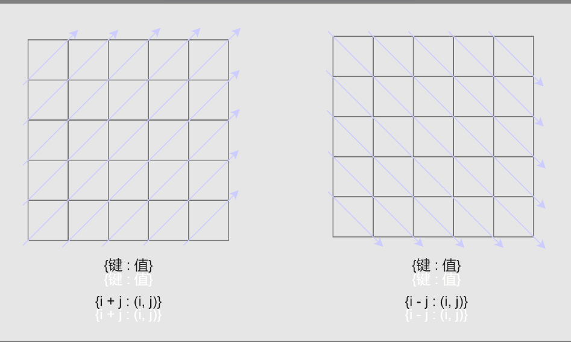

## 哈希表

### 构造哈希表

什么情况下会想到使用哈希表呢？当我们需要同时得到关联信息 时，可以使用哈希表建立 key 与 value 的映射关系。

**常用的构造方式**

- {键:频次}：使用频率最高，将元素出现的次数作为值；

- {键:数组}：如果一个键对应的信息是一组元素，可使用数组或链表存储。

- {键:平面坐标}：某些矩阵类习题可能会存储坐标；

- {键:其他}：一般出现在模拟题中，根据实际需要设计哈希表

### 设计键总结

1. 当字符串或数组中每个元素顺序不重要时，可以使用排序后的字符串或数组作为键

2. 如果只关心每个值的偏移量，通常是第一个值的偏移量，则可以使用偏移量作为键。

3. 在树的题目中，可以直接使用 TreeNode 作为键。但在大多数情况下，可以将 子树的序列化结果 作为键。

4. 在矩阵中，你可能会使用 行索引 或 列索引 作为键。

5. 如果需要将矩阵分块，可以将行索引和列索引进行组合以标识该元素属于哪个 块。

6. 有时，在矩阵中，你可能会希望将对角线的元素组合在一起

   
